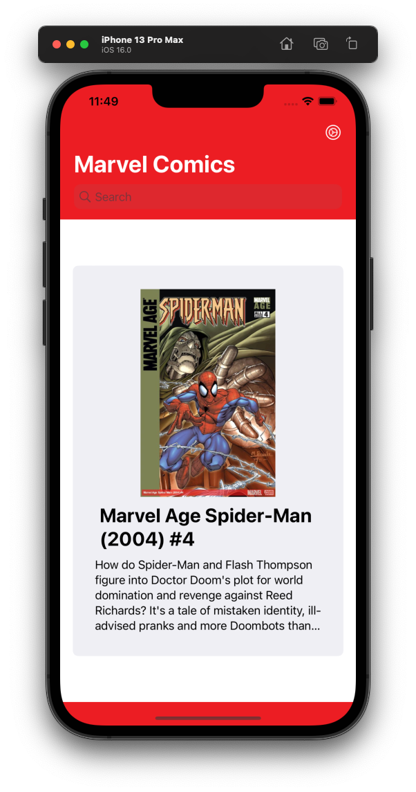
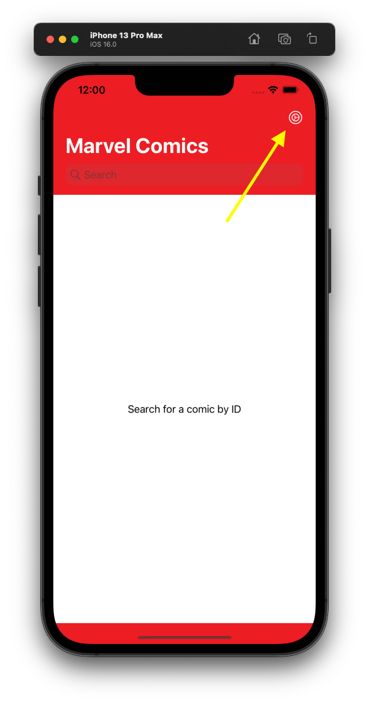
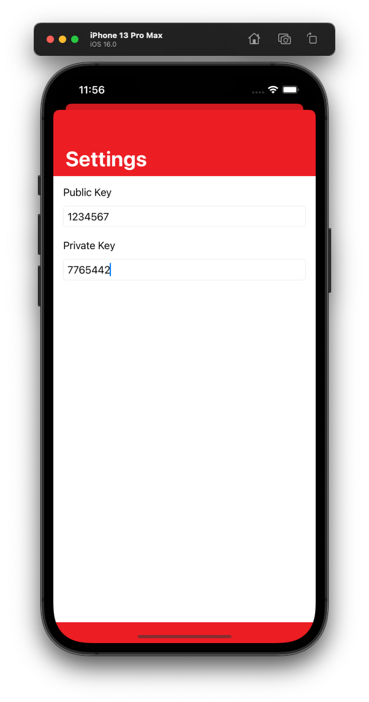

# Marvel App

An app to use the https://developer.marvel.com API to grab data of comics, characters, etc.

## Overview

This app only shows one view to the user. Where they can search for a comic book specified by an ID.

## Third Party Frameworks

Other frameworks that were used for this project:
- Alamofire: Used to make the network requests.
- Swinject: Dependency injection.

## Getting Started

In order to use the app you need to specify the public and private keys that are given to you from the https://developer.marvel.com website.

1. First go to the "Settings" page. This is by clicking on the gear icon.

    

2. Input your public and private keys.

    

3. You can now search for a comic by ID.

## DocC

You can view the full documentation of the Marvel App by building the documentation in Xcode. You do this by selecting Product > Build Documentation. This will show more details of the code that was created for this app.